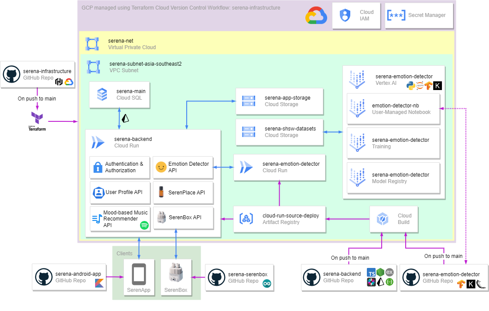

# Serena Infrastructure

- [Serena Infrastructure](#serena-infrastructure)
  - [Background](#background)
  - [Architecture](#architecture)
  - [Replication](#replication)
  - [Members Contributions](#members-contributions)

## Background

We require multiple services to realize our project. Therefore, we chose Google Cloud Platform for our Cloud Computing platform since it provides the necessary features.
Since there will be many services for us to manage, we decide to use Terraform Cloud as it will be easy for us to provision, manage, replicate, and automate our infrastructure.
We've setup our Terraform Cloud VCS-driven workflow so that whenever we push to `main` branch, it's going to deploy on GCP.

## Architecture

Our project is protected using IAM and service accounts, where we try to apply the principle of least privilege.
We store our secrets in Secret Manager that is protected by IAM as well.  

We prioritize setting up our services in asia-southeast2 (Jakarta) region as it is the closest region to our target users. Therefore, we created a subnet in the `serena-net` VPC.

Our backend and model is deployed using Cloud Build to Cloud Run, with their images saved in `cloud-run-source-deploy` Artifact Registry. Our data is stored in `serena-main` Cloud SQL for app and user data.
We use `serena-app-storage` Cloud Storage to store images from our app, such as user photos and SerenPlace images.

We utilize Vertex AI user-managed notebook, training, and model registry to help develop, train, and store our [Serena Emotion Detector model](https://github.com/Serena-Smart-Home-Smart-Wellbeing/serena-emotion-detector). Our dataset and model results are stored in `serena-shsw-datasets` Cloud Storage.

## Replication

Replicating our Terraform code would be difficult as we have setup our Terraform Cloud VCS-driven workflow with our own sensitive secrets and configurations.
However, here are some steps that you can follow to replicate our project:

1. Setup your [Terraform Cloud VCS-driven workflow](https://www.google.com/url?sa=t&rct=j&q=&esrc=s&source=web&cd=&cad=rja&uact=8&ved=2ahUKEwjutNDf3qCDAxXQg2MGHbJKCVIQFnoECA8QAQ&url=https%3A%2F%2Fdeveloper.hashicorp.com%2Fterraform%2Ftutorials%2Fcloud-get-started%2Fcloud-vcs-change&usg=AOvVaw17FiA00kFb3_wx55tloPQx&opi=89978449)
2. Create your GCP project and create a service account with Owner role to be used by Terraform Cloud
3. Download its JSON key and save it as `GOOGLE_CREDENTIALS` environment variable in your Terraform Cloud workspace
4. See the root files and adjust the values for your own configurations (e.g. in `providers.tf` change to your GCP project ID, region, and zone)
5. Setup your IAM in the [iam](./modules/iam) folder
6. Look at our other modules and adjust the values for your own configurations

If you want to just use our APIs, it would be easier to use our public APIs that is documented at [https://serena-backend-2g6tjw7nja-et.a.run.app/api-docs/](https://serena-backend-2g6tjw7nja-et.a.run.app/api-docs/)

## Members Contributions

|              Name              |    Student ID    |                                                                                                                  Contribution                                                                                                                  |
|:------------------------------:|:----------------:|:----------------------------------------------------------------------------------------------------------------------------------------------------------------------------------------------------------------------------------------------:|
|      Muhammad Reyhan Ardiya Putra Wijaya      | (CC) C200BSY3485 | Designed GCP architecture. Setup Terraform Cloud. Wrote Terraform code. Monitor and adjust deployed GCP project as needed. |
